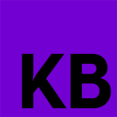

<div id="top"></div>

[![Contributors][contributors-shield]][contributors-url]
[![Forks][forks-shield]][forks-url]
[![Stargazers][stars-shield]][stars-url]
[![Issues][issues-shield]][issues-url]
[![MIT License][license-shield]][license-url]


<!-- PROJECT LOGO -->
<br />
<div align="center">
  <a href="https://github.com/spiceydev/spicey_ide">
    
  </a>

<h3 align="center">Kode book</h3>

  <p align="center">
    When you need somewhere to document your code, this is the place.
    <br />
    <br />
    <a href="https://github.com/spiceydev/spicey_ide">View Demo</a>
    ·
    <a href="https://github.com/spiceydev/spicey_ide/issues">Report Bug</a>
    ·
    <a href="https://github.com/spiceydev/spicey_ide/issues">Request Feature</a>
  </p>
</div>


<!-- TABLE OF CONTENTS -->
<details>
  <summary>Table of Contents</summary>
  <ol>
    <li>
      <a href="#about-the-project">About The Project</a>
      <ul>
        <li><a href="#built-with">Built With</a></li>
      </ul>
    </li>
    <li>
      <a href="#getting-started">Getting Started</a>
      <ul>
        <li><a href="#prerequisites">Prerequisites</a></li>
        <li><a href="#installation">Installation</a></li>
      </ul>
    </li>
    <li><a href="#usage">Usage</a></li>
    <li><a href="#contributing">Contributing</a></li>
    <li><a href="#license">License</a></li>
    <li><a href="#contact">Contact</a></li>
    <li><a href="#acknowledgments">Acknowledgments</a></li>
  </ol>
</details>


<!-- ABOUT THE PROJECT -->
## About The Project

[![Product Name Screen Shot][product-screenshot]](https://example.com)

I stated this project while studying for my software development diploma. At the time we weren't allowed to install any packages from npm, so I decided to build this project from scratch. It let's you run your code in a browser, and it's a great way to learn how to code. It also let's you share your code with others.

<p align="right">(<a href="#top">back to top</a>)</p>


### Built With

* [esbuild](https://esbuild.github.io/)
* [React.js](https://reactjs.org/)
* [Express](https://expressjs.com/)
* [Lerna](https://github.com/lerna/lerna)
* [Commander](https://www.npmjs.com/package/commander#commanderjs)
* [Bulma](https://bulma.io/)
* [Monaco Editor](https://microsoft.github.io/monaco-editor/)


<p align="right">(<a href="#top">back to top</a>)</p>


<!-- GETTING STARTED -->
## Getting Started
To get started follow the steps below

### Prerequisites

This is an example of how to list things you need to use the software and how to install them.
* npm
  ```sh
  npm install npm@latest -g
  ```

### Installation
You don't need to install anything, just run the following command in your terminal.
```sh
npx kode_book serve [filename]
```
This will start the software and create a file , if you omit the filename it will create a file called `notebook.js` in the current directory. Once the file has been created open your browser to the shown address.

<!-- USAGE EXAMPLES -->
## Usage

Once you have opened your browser you should be able to create either code or text cells. 

Text cells are markdown and are uses to explain od document the code cells.

Code cells use the Monaco Editor. All the code is bundled and run in the browser using esbuild.


<!-- LICENSE -->
## License

Distributed under the MIT License. See `LICENSE.txt` for more information.

<p align="right">(<a href="#top">back to top</a>)</p>


<!-- MARKDOWN LINKS & IMAGES -->
<!-- https://www.markdownguide.org/basic-syntax/#reference-style-links -->
[contributors-shield]: https://img.shields.io/github/contributors/spiceydev/spicey_ide.svg?style=for-the-badge
[contributors-url]: https://github.com/spiceydev/spicey_ide/graphs/contributors
[forks-shield]: https://img.shields.io/github/forks/spiceydev/spicey_ide.svg?style=for-the-badge
[forks-url]: https://github.com/spiceydev/spicey_ide/network/members
[stars-shield]: https://img.shields.io/github/stars/spiceydev/spicey_ide.svg?style=for-the-badge
[stars-url]: https://github.com/spiceydev/spicey_ide/stargazers
[issues-shield]: https://img.shields.io/github/issues/spiceydev/spicey_ide.svg?style=for-the-badge
[issues-url]: https://github.com/spiceydev/spicey_ide/issues
[license-shield]: https://img.shields.io/github/license/spiceydev/spicey_ide.svg?style=for-the-badge
[license-url]: https://github.com/spiceydev/spicey_ide/blob/master/LICENSE.txt

[product-screenshot]: images/screenshot.png